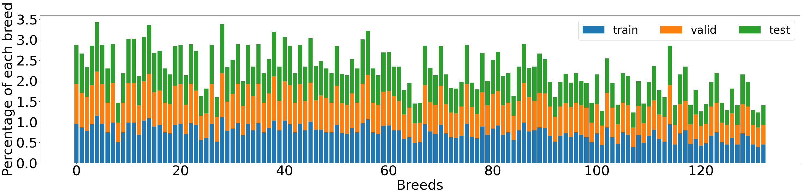

### Table of Contents

1. [Installation](#installation)
2. [Project Motivation](#motivation)
3. [File Descriptions](#descriptions)
4. [Project Analysis](#analysis)
5. [Web-Application](#web_app)
6. [Results](#results)
7. [Licensing, Authors, and Acknowledgements](#licensing)

## Installation <a name="installation"></a>

Python3.x with other packages in [requirements.txt](https://github.com/Chris7911/dog-breeds-project/blob/main/requirements/requirements.txt). Run the following command to install.
```bash
$ pip install -r requirements.txt
```

## Project Motivation <a name="motivation"></a>

Deep learning helps me solve lots of problems in my work, but putting a deep learning application on a web app is something I've never done before. So, that's why choosing this dog breed classifier as Data Scientist Nanodegree's capstone project to further my skill! This project might help host my other deep learning applications on a website for more people to use in the near future.

## File Descriptions <a name="descriptions"></a>

1. [dog_app.ipynb](https://github.com/Chris7911/dog-breeds-project/blob/main/dog_app.ipynb) walks you through every single step to finish this project
2. [extract_bottleneck_features.py](https://github.com/Chris7911/dog-breeds-project/blob/main/extract_bottleneck_features.py) bottleneck features of pre-trained models with according preprocess
3. [dog_names.txt](https://github.com/Chris7911/dog-breeds-project/blob/main/dog_names.txt) lists all breeds of dogs to classify on the web app
4. [app](https://github.com/Chris7911/dog-breeds-project/tree/main/app) includes all we need to build up a web app
5. [haarcascades](https://github.com/Chris7911/dog-breeds-project/tree/main/haarcascades) [Haar feature-based cascade classifiers](http://docs.opencv.org/trunk/d7/d8b/tutorial_py_face_detection.html) to detect human faces in images
6. [saved_models](https://github.com/Chris7911/dog-breeds-project/tree/main/saved_models) includes Xception model for breeds prediction on the web app

## Project Analysis <a name="analysis"></a>

### Problem Introduction
This project is aimed to develop a dog breed classifier. When a user provides an image of a dog as an input, the classifier needs to predict its breed as an output. Moreover, if there is a human in the photo, the classifier should be able to give the most similar appearance of breed for that person. Therefore, we can break the project down into three problems.
Our algorithm has the ability to ..
1. Identify a human in an image and give it a breed
2. Recognize a dog in an image and give it a breed
3. Give an error when the creature in the photo is neither a human nor a dog

### Strategy to Solve the Problem
With real-world problem solving, we can combine more than one model together to achieve our goal.
1. To identify humans by using OpenCV's Cascade classifier to detect human faces in an image
2. To recognize dogs by using pre-trained model ResNet-50 from Keras
3. To predict a breed of a dog or human, we will use Xception as a pre-train model and further train it with a dog breed dataset

### Metrics
The most commonly and easily used metric for classification problems is accuracy.

*Accuracy = Number of Correct Predictions / Total Number of Predictions*

### EDA
The dataset of dog images provided by Udacity includes:
133 dog categories
8351 dog images, where 6680 images for the training set, 835 images for the validation set, and 836 images for the test set (8:1:1)

According to the distribution of breeds in each subset below, train, valid, and test have a similar percentage of each breed. That is to say, they have a similar **bias** for some breeds of dogs such as **Alaskan_malamut** and **Border_colli** (These two breeds of dogs have more images than the others).



### Modelling
#### Transfer Learning ####
We've used [Xception](https://s3-us-west-1.amazonaws.com/udacity-aind/dog-project/DogXceptionData.npz) as a pre-trained model that is available in Keras. Also, Udacity provides Xception with preprocess_input (normalization) in [extract_bottleneck_features.py](https://github.com/Chris7911/dog-breeds-project/blob/main/extract_bottleneck_features.py). The only thing we have to do is to import it!

#### Model Architecture ####
As you can see in the summary of model architecture below, pre-trained model Xception is followed by **GlobalAveragePooling2D** and **Dense**. **GlobalAveragePooling2D** has a smaller dense layer afterward rather than **Flatten**. With a tinier model, we might be able to avoid overfitting problems. Finally, using **Dense** layer fits the number of breeds, with **softmax** to help handle multiple classes.


### Hyperparameter tuning
Firstly, we used 20 epochs and a batch size of 20 as the control group, and it got an 84.09% accuracy on the test dataset. As we increased epochs from 20 to 30, the accuracy was nothing change so the checkpointer didn't update the best weights. For that reason, we went back to see the training loss go down but the valid loss go up. We assumed that overfitting occurred between 20 and 30 epochs. Therefore, we opted to change the batch size from 20 to 32, and it got a better result with an 84.44% accuracy. Accordingly, we continued increasing the batch size from 32 to 64, and the accuracy goes up to 85.88%. However, the accuracy stopped growing as we set a higher batch size. Therefore, another way should be applied if we want to find a better local minimum.

### Results
With the same hyperparameters, VGG16 got a 69.85% accuracy and Xception got an 84.09% accuracy on the test set. Why? Compared to the fat VGG16 (528MB), Xception (88MB) is an extreme version of Inception as it simply replaces Inception modules with depthwise separable convolutions so its pre-trained model originally got a better accuracy (Top-1 Accuracy: 0.79, Top-5 Accuracy: 0.945) rather than VGG16 with accuracy (Top-1 Accuracy: 0.713, Top-5 Accuracy: 0.901) on ImageNet. So, with pre-trained model Xception, we got a faster training process and a better result!

### Conclusion
The performance of my algorithm is better than my expectation. If the dog detector can recognize the creature in the photo as a dog, the dog breed classifier will be able to predict the breed of that dog accurately. However, some corner cases made my algorithm fail to give the right answer. For example, the dog detector cannot recognize the dog wearing red and controlling the steering wheel like a human. Also, the human detector predicts a humanoid robot as a human.

### Improvements
1. Train a dog detector with dogs (mix all breeds together) in general, instead the one is based on its breeds to make a decision if it is a dog or not. Separately, we can use the general dog detector to figure out if the creature is a dog or not and further to recognize its breed by using dog breed classifier.

2. In order to make the general dog detector more robust, we have to collect more images of dogs wearing clothes. No matter what breeds they are.

3. Combine the dog detector with the human detector and add another class (humanoid robot) to it. So, classes of the brand new detector will be like 1.dog; 2.human(person); 3.humanoid robot, with decent confidence to avoid considering other creatures as the three classes we provide. Therefore, there are only two models in our new algorithm to meet the requirement of the project. The first model detects if there are dogs or humans in a photo, and then the second model recognizes their breeds.

4. (Optional) Collect more data related to the three classes to generalize the models; Find a better model architecture; Spend more time to fine-tune hyperparameters; Use other metrics like precision or recall to judge our algorithm.

## Web-Application <a name="web_app"></a>

Please follow steps below to open the web-app:

#### Step 1: #### 
Be sure to clone my project (original project doesn't include /app, and dog_names.txt) and install all packages in [requirements.txt](https://github.com/Chris7911/dog-breeds-project/blob/main/requirements/requirements.txt), especially **flask**.

#### Step 2: #### 
Go to /app and run the following command:
```bash
$ export FLASK_APP=run.py
$ flask run
 *Running on http://127.0.0.1:5000/
```

#### Step 3: ####
Open a browser and type in http://127.0.0.1:5000/. On the front page of the website, hit the button **Browse** to upload an image and **Submit** it to see the result.


#### Step 4: ####
On the same page, you can see the result from the buttons below:


## Licensing, Authors, Acknowledgements <a name="licensing"></a>

Thanks to Data Scientist Nanodegree - Udacity and its templates to follow from **Dog Breed Workspace**

Thanks to [Arif Ul Islam](https://arifulislam-ron.medium.com/flask-web-application-to-classify-image-using-vgg16-d9c46f29c4cd) and [StackOverflow](https://stackoverflow.com/questions/46785507/python-flask-display-image-on-a-html-page/46794505) help me build up my web app.
