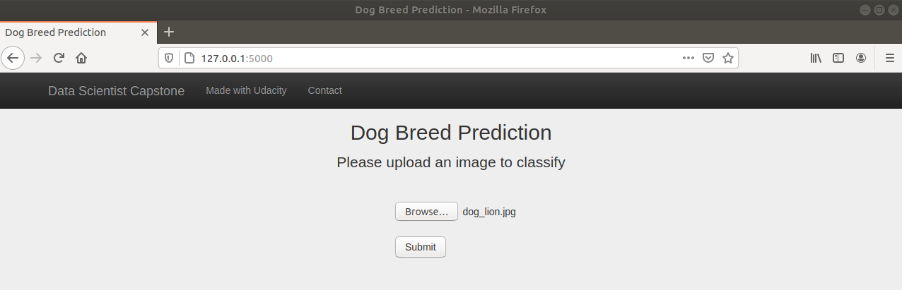
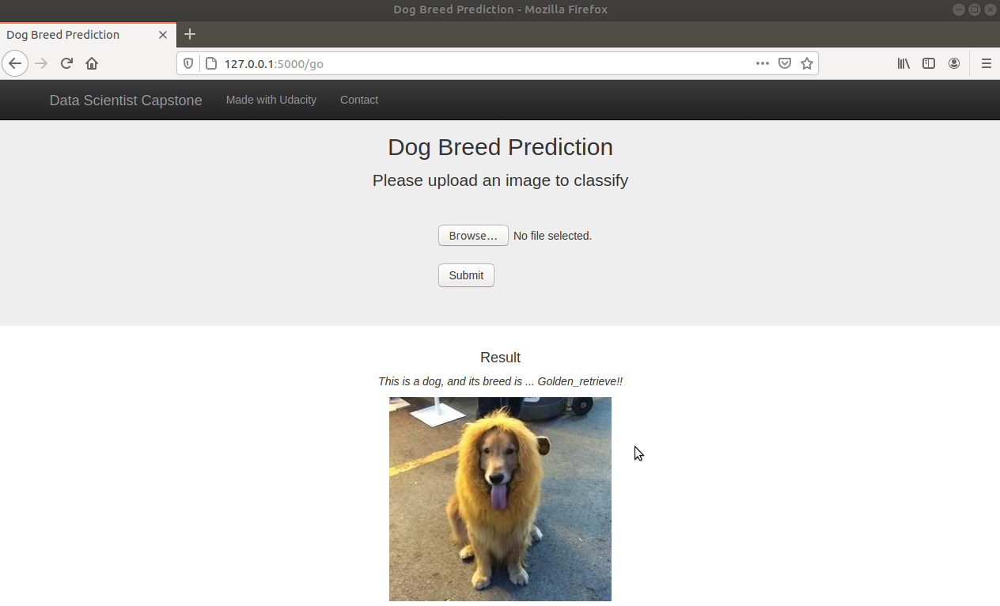

### Table of Contents

1. [Installation](#installation)
2. [Project Motivation](#motivation)
3. [File Descriptions](#descriptions)
4. [Web-Application](#web_app)
5. [Results](#results)
6. [Licensing, Authors, and Acknowledgements](#licensing)

## Installation <a name="installation"></a>

Python3.x with other packages in [requirements.txt](https://github.com/Chris7911/dog-breeds-project/blob/main/requirements/requirements.txt). Run the following command to install.
```bash
$ pip install -r requirements.txt
```

## Project Motivation <a name="motivation"></a>

Deep learning helps me solve lots of problems in my work, but putting a deep learning application on a web app is something I've never done before. So, that's why choosing this dog breed classifier as Data Scientist Nanodegree's capstone project to further my skill! This project might help host my other deep learning applications on a website for more people to use in the near future.

## File Descriptions <a name="descriptions"></a>

1. [dog_app.ipynb](https://github.com/Chris7911/dog-breeds-project/blob/main/dog_app.ipynb) walks you through every single step to finish this project
2. [extract_bottleneck_features.py](https://github.com/Chris7911/dog-breeds-project/blob/main/extract_bottleneck_features.py) bottleneck features of pre-trained models with according preprocess
3. [dog_names.txt](https://github.com/Chris7911/dog-breeds-project/blob/main/dog_names.txt) lists all breeds of dogs to classify on the web app
4. [app](https://github.com/Chris7911/dog-breeds-project/tree/main/app) includes all we need to build up a web app
5. [haarcascades](https://github.com/Chris7911/dog-breeds-project/tree/main/haarcascades) [Haar feature-based cascade classifiers](http://docs.opencv.org/trunk/d7/d8b/tutorial_py_face_detection.html) to detect human faces in images
6. [saved_models](https://github.com/Chris7911/dog-breeds-project/tree/main/saved_models) includes Xception model for breeds prediction on the web app

## Web-Application <a name="web_app"></a>

Please follow steps below to open the web-app:

#### Step1: #### 
Be sure to clone my project (original project doesn't include /app, and dog_names.txt) and install all packages in [requirements.txt](https://github.com/Chris7911/dog-breeds-project/blob/main/requirements/requirements.txt), especially **flask**.

#### Step2: #### 
Go to /app and run the following command:
```bash
$ export FLASK_APP=run.py
$ flask run
 *Running on http://127.0.0.1:5000/
```

#### Step3: ####
Open a browser and type in http://127.0.0.1:5000/. On the front page of the website, hit the button **Browse** to upload an image and **Submit** it to see the result.



#### Step4: ####
On the same page, you can see the result from the buttons below:




## Results <a name="results"></a>

The performance of my algorithm is better than my expectation. If the dog detector can recognize the creature in the photo as a dog, dog breed classifier will be able to predict the breed of that dog accurately. However, some corner cases made my algorithm fail to give the right answer. For example, the dog detector cannot recognize the dog wearing red and controlling the steering wheel like a human. Also, the human detector predicts a humanoid robot as a human. In order to fix the corner cases above, there are some ideas to improve my algorithm:

1. Train a dog detector with dogs (mix all breeds together) in general, instead the one is based on its breeds to make a decision if it is a dog or not. Separately, we can use the general dog detector to figure out if the creature is a dog or not and further to recognize its breed by using dog breed classifier.

2. In order to make the general dog detector more robust, we have to collect more images of dogs wearing clothes. No matter what breeds they are.

3. Combine the dog detector with the human detector and add another class (humanoid robot) to it. So, classes of the brand new detector will be like 1.dog; 2.human(person); 3.humanoid robot, with decent confidence to avoid considering other creatures as the three classes we provide. Therefore, there are only two models in our new algorithm to meet the requirement of the project. The first model detects if there are dogs or humans in a photo, and then the second model recognizes their breeds.

4. (Optional) Collect more data related to the three classes to generalize the models; Find a better model architecture; Spend more time to fine-tune hyperparameters; Use other metrics like precision or recall to judge our algorithm.


## Licensing, Authors, Acknowledgements <a name="licensing"></a>

Thanks to Data Scientist Nanodegree - Udacity and its templates to follow from **Dog Breed Workspace**

Thanks to [Arif Ul Islam](https://arifulislam-ron.medium.com/flask-web-application-to-classify-image-using-vgg16-d9c46f29c4cd) and [StackOverflow](https://stackoverflow.com/questions/46785507/python-flask-display-image-on-a-html-page/46794505) help me build up my web app.

